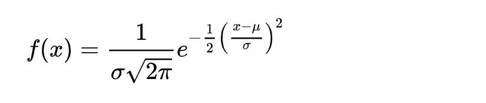

## important links

## Descriptive and inferential statistics
lorem ipsum
### Descriptive statistics

#### mean and weighed mean
mean is the average of set of values. he operation is simple to do: sum the values and divide by the number of values.  
The mean is useful because it shows where the “center of gravity” exists for an observed set of values.

```python
from math import fsum
# Number of pets each person owns
sample = [1, 3, 2, 5, 7, 0, 2, 3]

mean = fsum(sample) / len(sample)

print(mean) # prints 2.875
```
Following is how weighted mean is computed.  
```python
sample = [90, 80, 63, 87]
weights = [.20, .20, .20, .40]

weighted_mean = sum((s * w for s, w in zip(sample, weights)))/ sum(weights)
print(weighted_mean)
```
#### median
median is the middle most value in an ordered list of values. in case there are two center, we take the average of two numbers and   
call it median.
```python
sample = [0, 1, 5, 7, 9, 10, 14]

if len(sample) % 2 == 0:
    median = (sample[len(sample) // 2] + sample[len(sample) // 2 - 1]) / 2
else:
    median = sample[len(sample) // 2]

```
median can be a helpful alternative to the mean when data is skewed by outliers.
In 1986, the mean annual starting salary of geography graduates from the University of North Carolina at Chapel Hill was $250,000.
Other universities averaged $22,000. Wow, UNC-CH must have an amazing geography program!  

But in reality, what was so lucrative about UNC’s geography program? Well…Michael Jordan was one of their graduates. One  
of the most famous NBA players of all time indeed graduated with a geography degree from UNC. However, he started his career  
playing basketball, not studying maps. Obviously, this is a confounding variable that has created a huge outlier, and it majorly  
skewed the income average.  

When your median is very different from your mean, that means you have a skewed dataset with outliers.

#### mode
The mode is the most frequently occurring set of values. It primarily becomes useful when your data is repetitive and  
you want to find which values occur the most frequently.

When no value occurs more than once, there is no mode. When two values occur with an equal amount of frequency, then the  
dataset is considered bimodal. In Example 3-5 we calculate the mode for our pet dataset, and sure enough we see this is bimodal  
as both 2 and 3 occur the most (and equally) as often.  
```python
from collections import defaultdict

sample = [1, 3, 2, 5, 7, 0, 2, 3]

def mode(values):
    counts = defaultdict(lambda: 0)

    for s in values:
        counts[s] += 1

    max_count = max(counts.values())
    modes = [v for v in set(values) if counts[v] == max_count]
    return modes

print(mode(sample)) # [2, 3]
```
#### Population Variance and Standard Deviation
In describing data, we are often interested in measuring the differences between the mean and every data point. This gives us a sense of how “spread out” the data is.  

Let’s say I’m interested in studying the number of pets owned by members of my work staff (note that I’m defining this as my population, not a sample). I have seven people on my staff.  

I take the mean of all the numbers of pets they own, and I get 6.571. Let’s subtract this mean from each value. This will show us how far each value is from the mean as shown.  

now consider why this information can be useful. The differences give us a sense of how spread out the data is and how far values are from the mean.  
Is there a way we can consolidate these differences into a single number to quickly describe how spread out the data is?  
You may be tempted to take the average of the differences, but the negatives and positives will cancel each other out when  
they are summed. We could sum the absolute values (rid the negative signs and make all values positive). An even better  
approach would be to square these differences before summing them. This not only rids the negative values (because squaring a  
negative number makes it positive), but it amplifies larger differences and is mathematically easier to work with (derivatives are  
not straightforward with absolute values). After that, average the squared differences. This will give us the variance, a measure of how spread out our data is.  

```python
from math import sqrt

# Number of pets each person owns
data = [0, 1, 5, 7, 9, 10, 14]

def variance(values):
    mean = sum(values) / len(values)
    _variance = sum((v - mean) ** 2 for v in values) / len(values)
    return _variance

def std_dev(values):
    return sqrt(variance(values))

print(std_dev(data))  # prints 4.624689730353898
```
#### Sample variance and sample std
In the previous section we talked about variance and standard deviation for a population. However, there is an important  
tweak we need to apply to these two formulas when we calculate for a sample:

Did you catch the difference? When we average the squared differences, we divide by n–1 rather than the total number of items n.  
Why would we do this? We do this to decrease any bias in a sample and not underestimate the variance of the population based on our sample.  
By counting values short of one item in our divisor, we increase the variance and therefore capture greater uncertainty in our sample.


#### The normal distribution
The normal distribution, also known as the Gaussian distribution, is a symmetrical bell-shaped distribution that has most  
mass around the mean, and its spread is defined as a standard deviation. The “tails” on either side become thinner as you move away from the mean.

Is there a better way to visualize this likelihood to see which golden retriever weights we are more likely to see sampled  
from the population? We can try to create a histogram, which buckets (or “bins”) up values based on numeric ranges of equal length,  
and then uses a bar chart showing the number of values within each range.  
The normal distribution has several important properties that make it useful:

1. It’s symmetrical; both sides are identically mirrored at the mean, which is the center.

2. Most mass is at the center around the mean.

3. It has a spread (being narrow or wide) that is specified by standard deviation.

4. The “tails” are the least likely outcomes and approach zero infinitely but never touch zero.

5. It resembles a lot of phenomena in nature and daily life, and even generalizes nonnormal problems because of the central limit theorem, which we will talk about shortly.  

#### PDF
The probability density function (PDF) that creates the normal distribution is as follows:

There’s a lot to take apart here in this formula, but what’s important is that it accepts a mean and standard deviation as parameters,  
as well as an x-value so you can look up the likelihood at that given value.

Just like the beta distribution in Chapter 2, the normal distribution is continuous. This means to retrieve a probability  
we need to integrate a range of x values to find an area.  
#### CDF
With the normal distribution, the vertical axis is not the probability but rather the likelihood (which has already occurred) for the data.  
To find the probability we need to look at a given range, and then find the area under the curve for that range.  
Let’s say I want to find the probability of a golden retriever weighing between 62 and 66 pounds. Figure 3-7 shows the range we want to find the area for.


the CDF provides the area up to a given x-value for a given distribution. Let’s see what the CDF looks like for our  
golden retriever normal distribution and put it alongside the PDF for reference in Figure 3-8.  


Let us say mean of golden retrievers' height is 64.43 and std dev is 2.99. We want calcualte area of pdf from -inf to mean.
```python
from scipy.stats import norm

mean = 64.43
std_dev = 2.99

x = norm.cdf(64.43, mean, std_dev)
print(x)
```
Let say, we want to find out the probability of observing a golden retriever between 62 and 66 pounds. Pictorially, below is what we are trying to find.  

```python
from scipy.stats import norm

mean = 64.43
std_dev = 2.99

x = norm.cdf(66, mean, std_dev) - norm.cdf(62, mean, std_dev)

print(x) # prints 0.4920450147062894
```
Let us do the opposite. i want to find the weight that 95% of golden retrievers fall under:  
```python
from scipy.stats import norm
mean = 64.43
std_dv = 2.99
x = norm.ppf(.95, loc=mean, scale=std_dv)
print(x) # 69.3481123445849
```
The answer is 69.34.  
#### generate random numbers for normal distribution
```python
import random
from scipy.stats import norm

for i in range(0,1000):
    random_p = random.uniform(0.0, 1.0)
    random_weight = norm.ppf(random_p,  loc=64.43, scale=2.99)
    print(random_weight)
```

#### z score
Z score is a technique to represent all x values in terms of standard deviations.Turning an x-value into a Z-score uses a basic scaling formula:  


Here is an example. We have two homes from two different neighborhoods. Neighborhood A has a mean home value of $140,000 and  
standard deviation of $3,000. Neighborhood B has a mean home value of $800,000 and standard deviation of $10,000.  
µ(A) = 140000  
µ(B) = 800000  
σ(A) = 3000  
σ(B) =  10000  
Now we have two homes from each neighborhood. House A from neighborhood A is worth $150,000 and house B from neighborhood    
B is worth $815,000. Which home is more expensive relative to the average home in its neighborhood?  
x(A) = 150000  
x(B) = 815000  
z(A) = (150000 - 140000) / 3000 =  3.333    
z(B) = (815000 - 800000) / 10000 =  1.5  
So the house in neighborhood A is actually much more expensive relative to its neighborhood than the house in neighborhood B, as they have Z-scores of  and 1.5, respectively.  
```python
def z_score(x, mean, std):
    return (x - mean) / std


def z_to_x(z, mean, std):
    return (z * std) + mean


mean = 140000
std_dev = 3000
x = 150000

# Convert to Z-score and then back to X
z = z_score(x, mean, std_dev)
back_to_x = z_to_x(z, mean, std_dev)

print("Z-Score: {}".format(z))  # Z-Score: 3.333
print("Back to X: {}".format(back_to_x))  # Back to X: 150000.0
```

  


