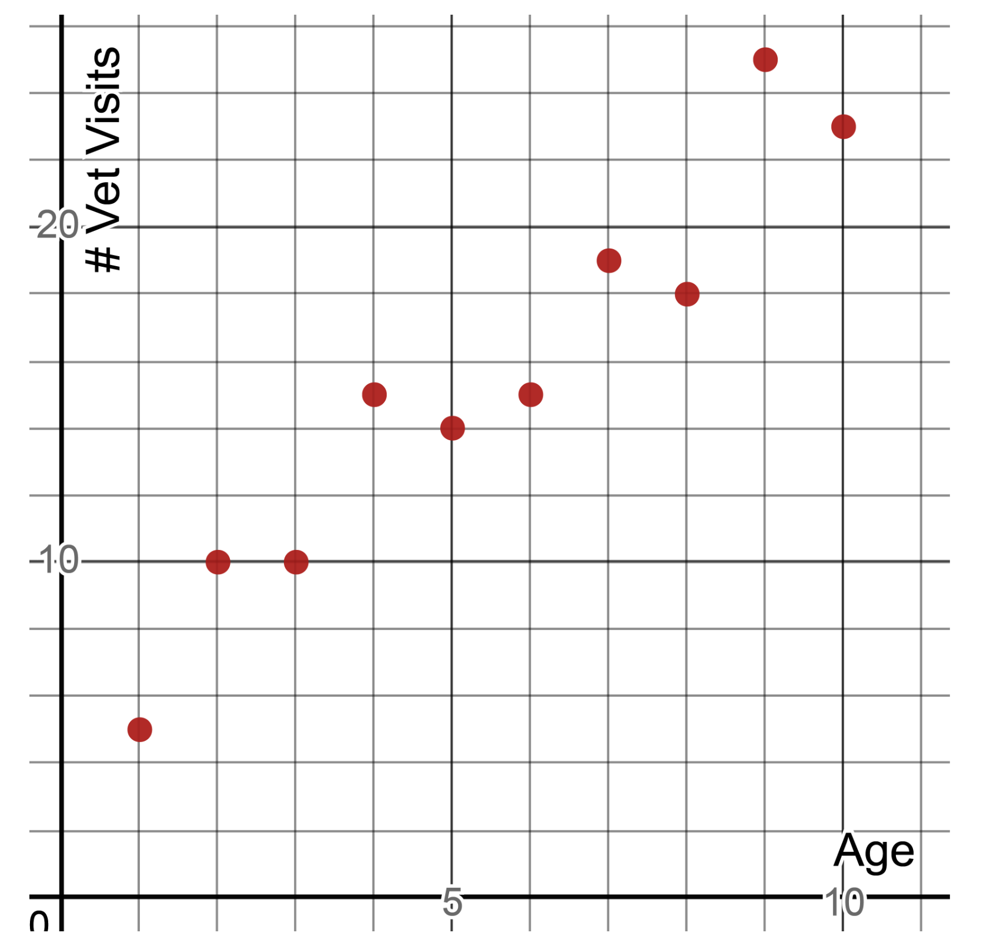
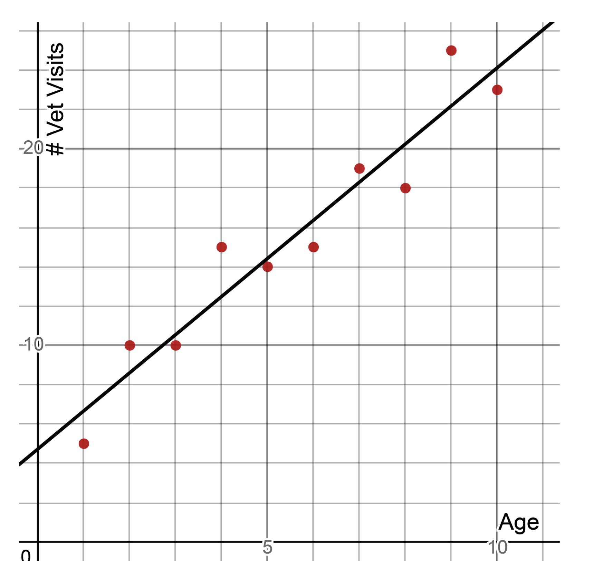
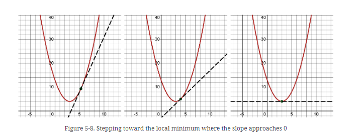
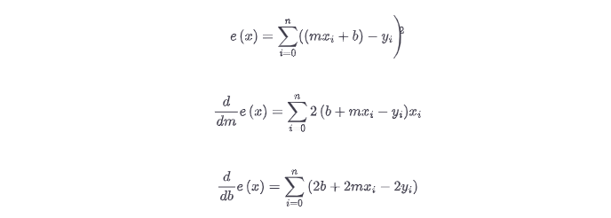

## links

## Linear regression
A regression attempts to fit a function to observed data. this function can be used to make prediction on new data.  
A linear regression fits a straight line to observed data. This tries to show linear relationship between two variables.  
This line can be used to make prediction on new data.  
I want to study the relationship between the age of a dog and the number of veterinary visits it had. In a fabricated    
sample we have 10 random dogs. I am a fan of understanding complex techniques with simple datasets (real or otherwise),  
so we understand the strengths and limitations of the technique without complex data muddying the water. Let’s plot this dataset.  

We can clearly see there is a linear correlation here, meaning when one of these variables increases/decreases, the other  
increases/decreases in a roughly proportional amount. We could draw a line through these points to show a correlation.  


Following is a sample code to fit a line using linear regression using scikit learn:  
```python
import pandas as pd
from sklearn.linear_model import LinearRegression
import matplotlib.pyplot as plt

df = pd.read_csv('single_independent_variable_linear_small.csv')
X = df.loc[:, ['x']].to_numpy()
Y = df.loc[:, ['y']].to_numpy()
fit = LinearRegression().fit(X, Y)
m = fit.coef_.flatten()
b = fit.intercept_.flatten()
print("m = {0}".format(m))
print("b = {0}".format(b))

# show in chart
plt.plot(X, Y, 'o') # scatterplot
plt.plot(X, m*X+b) # line
plt.show()
```

Let us calculate residuals:
```python
import pandas as pd


df = pd.read_csv('single_independent_variable_linear_small.csv')
# Test with a given line
m = 1.93939
b = 4.73333

def print_residuals(row):
    y_actual = row['y']
    y_predit = m*row['x'] + b
    residual = y_actual - y_predit
    print(residual)


df.apply(print_residuals, axis=1)
```

## Gradient descent example
For the function (x-3)**2 + 4, let’s find the x-value that produces the lowest point of that function. While we could solve this algebraically, let’s use gradient descent to do it.

Here is visually what we are trying to do. As shown in Figure 5-8, we want to “step” x toward the minimum where the slope is 0.



## Gradient Descent and Linear Regression
You now might be wondering how we use this for linear regression. Well, it’s the same idea except our “variables” are m and b (or  and ) rather than x. Here’s why:  
in a simple linear regression we already know the x- and y-values because those are provided as the training data. The “variables” we need to solve are actually  
the parameters m and b, so we can find the best fit line that will then accept an x variable to predict a new y-value.

How do we calculate the slopes for m and b? We need the partial derivatives for each of these. What function are we taking the derivative of? Remember we are  
trying to minimize loss and that will be the sum of squares. So we need to find the derivatives of our sum of squares function with respect to m and b.  

In mathematical notation, where e(x) represents the sum of squares loss function, here are the partial derivatives for m and b:  

