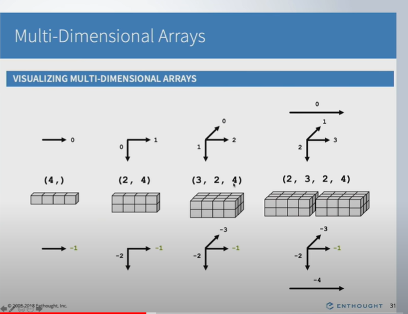

# Important numpy concepts

## Why Numpy arrays are faster compared to python lists
1. in numpy, you can store only one type. Due to which it needs less size as compared to list. for example,
if you are storing int32 in numpy, each element will take 32 bit. in case of python list, each element will take more size.
Check the following diagram:

## Visualizing multidimensional arrays

