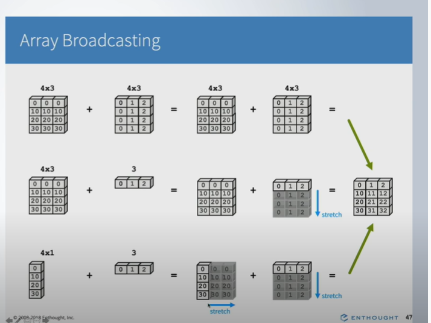
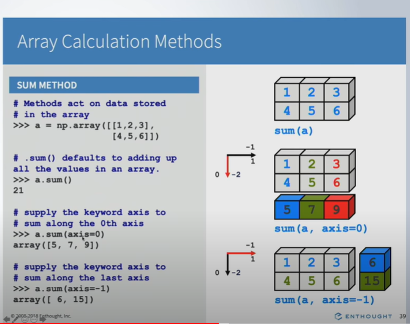
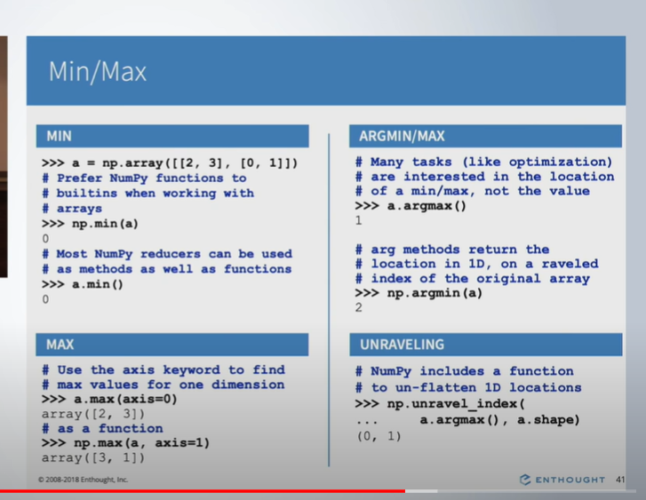
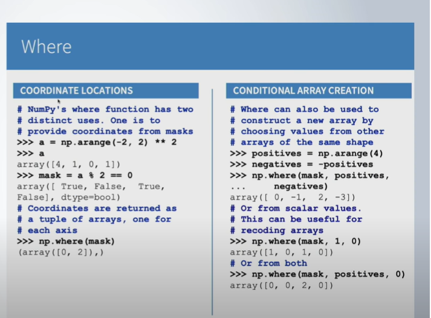

# Important numpy concepts

## Why Numpy arrays are faster compared to python lists
1. in numpy, you can store only one type. Due to which it needs less size as compared to list. for example,
if you are storing int32 in numpy, each element will take 32 bit. in case of python list, each element will take more size.
Check the following diagram:

## Visualizing multidimensional arrays


## Computations with array rules
1. Operations between multiple array objects are first checked for proper shape match
2. Mathematical operations (+-* exp etc) are applied element by element on the values
3. Reduce operations (std, kurt, mean, skew etc) are applied on the whole array unless an axis is specified
4. Missing values propagate unless specifically ignored

## Broadcasting


## Array calculation methods


## numpy min max 


## where function

###Syntax of np.where()
numpy.where(condition[, x, y])  
condition: A conditional expression that returns a Numpy array of bool  
x, y: Arrays (Optional i.e. either both are passed or not passed)  
If x & y are passed in np.where(), then it returns the elements selected from x & y based on condition on original    
array depending on values in bool array yielded by the condition.  
Returns:  
If x & y parameters are passed then it returns a new numpy array by selecting items from x & y based on the result  
from applying condition on original numpy array.  
If x & y arguments are not passed and only condition argument is passed then it returns the indices of the elements that  
are True in bool numpy array. If the original array is multidimensional then it returns a tuple of arrays (one for each axis).  
[how it works] [https://thispointer.com/numpy-where-tutorial-examples-python/]


```python

```

