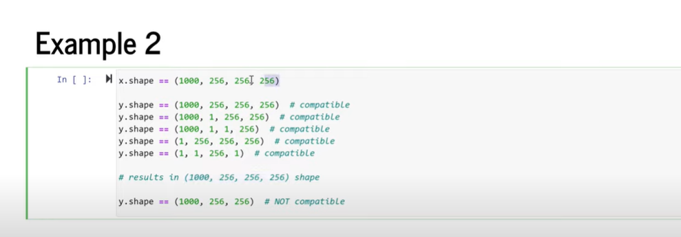

# Important numpy concepts

## references
[numpy intro] (https://www.youtube.com/watch?v=ZB7BZMhfPgk&t=4727s)

## Why Numpy arrays are faster compared to python lists
Numpy arrays are contiguously packed arrays of homogeneous type. Python lists, by contrast, are arrays of pointers to objects, 
even when all of them are of the same type. Therefore accessing elements of numpy array is faster than elements of python list.
in other words in numpy, it is just a matter of pointer addition to access any element. python list stores reference to objects, and those objects
may not be stored contiguously.

One more reason for numpy being fast is, operations on array in numpy are vectorized operations. Vectorized operations in numpy delegate the responsibility of
lopping to highly optimized c functions. Which are faster than looping in python.


## Visualizing multidimensional arrays


## Computations with array rules
1. Operations between multiple array objects are first checked for proper shape match
2. Mathematical operations (+-* exp etc) are applied element by element on the values
3. Reduce operations (std, kurt, mean, skew etc) are applied on the whole array unless an axis is specified
4. Missing values propagate unless specifically ignored

## Broadcasting
  
### Shape compatibility rules
1. if x and y have a different number of dimensions, prepend 1's to the shape of shorter
2. Any axis of length 1 can be repeated (boradcast) to the length of the other vector's length in the axis
3. All other axes must match  
  
  
  


## Array calculation methods


## numpy min max 


## where function


### Syntax of np.where()  
numpy.where(condition[, x, y])  
condition: A conditional expression that returns a Numpy array of bool  
x, y: Arrays (Optional i.e. either both are passed or not passed)  
If x & y are passed in np.where(), then it returns the elements selected from x & y based on condition on original    
array depending on values in bool array yielded by the condition.  
Returns:  
If x & y parameters are passed then it returns a new numpy array by selecting items from x & y based on the result  
from applying condition on original numpy array.  
If x & y arguments are not passed and only condition argument is passed then it returns the indices of the elements that  
are True in bool numpy array. If the original array is multidimensional then it returns a tuple of arrays (one for each axis).  
[how it works] [https://thispointer.com/numpy-where-tutorial-examples-python/]

## memory view


## when you do fancy indexing, numpy returns copy. in case you do slice operation, it does not return a copy, it rather returns view in to the original array

```python

```

## short programming snippets
###Calculate ecuclidian distance from two numpy vectors
```python
import numpy as np
a = np.array((0, 0, 0))
b = np.array((1, 1, 1))
np.linalg(a, b)

```
### How do I get indices of N maximum values in a NumPy array?
[explanation](https://numpy.org/doc/stable/reference/generated/numpy.argpartition.html)
```python
import numpy as np

a = np.array([9, 4, 4, 3, 3, 9, 0, 4, 6, 0])

ind = np.argpartition(-a, 4)[:4]
print(a[ind])
#or
print(-np.partition(-a, 4)[:4])
```

### Find nearest value in a numpy array
```python
import numpy as np
def find_nearest(array, value):
    array = np.asarray(array)
    idx = (np.abs(array - value)).argmin()
    return array[idx]

```
### Pandas conditional creation of a series/dataframe column
if you have only two choices to select from:
```python
import pandas as pd
import numpy as np

df = pd.DataFrame({'Type':list('ABBC'), 'Set':list('ZZXY')})
df['color'] = np.where(df['Set']=='Z', 'green', 'red')
print(df)
```
We can also do it using list comprehension:
```python
import pandas as pd

df = pd.DataFrame({'Type':list('ABBC'), 'Set':list('ZZXY')})
df['color'] = ['green' if x == 'Z' else 'red' for x in df.loc[:, 'Set']]
```
If  you have more than two conditions then use np.select. For example, if you want color to be:
```python
import pandas as pd
import numpy as np
df = pd.DataFrame({'Type':list('ABBC'), 'Set':list('ZZXY')})
conditions = [
    (df['Set'] == 'Z') & (df['Type'] == 'A'),
    (df['Set'] == 'Z') & (df['Type'] == 'B'),
    (df['Type'] == 'B')]
choices = ['yellow', 'blue', 'purple']
df['color'] = np.select(conditions, choices, default='black')
print(df)
```
### What does numpy.random.seed(0) do?
it makes random numbers predictable.  
With the seed reset (every time), the same set of numbers will appear every time.
```shell script
>>> numpy.random.seed(0) ; numpy.random.rand(4)
array([ 0.55,  0.72,  0.6 ,  0.54])
>>> numpy.random.seed(0) ; numpy.random.rand(4)
array([ 0.55,  0.72,  0.6 ,  0.54])
```
if seed is not reset, different set of numbers will be produced.  
(pseudo-)random numbers work by starting with a number (the seed), multiplying it by a large number, adding an offset,  
then taking modulo of that sum. The resulting number is then used as the seed to generate the next "random" number.  
When you set the seed (every time), it does the same thing every time, giving you the same numbers.  


