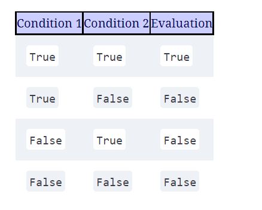
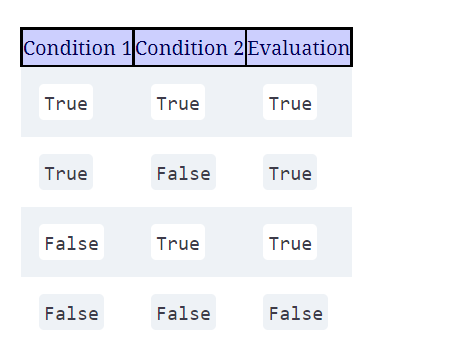
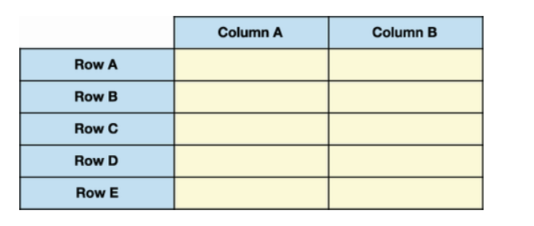
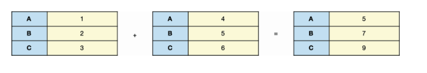

# Important pandas concepts
### resources
[pandas cookbook] (https://learning.oreilly.com/library/view/pandas-1-x-cookbook)  
[Pandas interview question] (https://www.kaggle.com/getting-started/119445)
[Pandas documentation] (https://pandas.pydata.org/docs/user_guide/timeseries.html)
[Pandas Getting Started] (https://pandas.pydata.org/docs/getting_started/intro_tutorials/09_timeseries.html)
[Pandas blog] (https://pbpython.com/pandas_transform.html)
[jezrael] (https://stackoverflow.com/users/2901002/jezrael)
### filtering in dataframe and series
#### filtering by single condition
```python
import pandas as pd
employees = pd.read_csv("employees.csv", parse_dates = ["Start Date"]).head()
marias = employees["First Name"] == "Maria"
# following two lines are same
employees.loc[marias, :]
employees[marias]
```
employees["First Name"] == "Maria" returns a series of boolean (also known as boolean masks)
```shell script
Out [22] 0       False
         1       False
         2        True
         3       False
         4       False
                 ...
         996     False
         997     False
         998     False
         999     False
         1000    False
         Name: First Name, Length: 1001, dtype: bool
```
#### filtering by multiple condition
We can filter a DataFrame with multiple conditions by creating two independent Boolean Series and then declaring
the logical criterion that pandas should apply between them.
Suppose that we want to find all female employees who work on the business development team. Now pandas must look
for two conditions to select a row: a value of "Female" in the Gender column and a value of "Business Dev" in the Team
column. The two criteria are independent, but both must be met. Here’s a quick reminder of how AND logic works with two conditions:


##### and condition
```python
import pandas as pd
employees = pd.read_csv("employees.csv", parse_dates = ["Start Date"]).head()
marias = employees["First Name"] == "Maria"
is_female = employees["Gender"] == "Female"
in_biz_dev = employees["Team"] == "Business Dev"
employees[is_female & in_biz_dev].head()
employees.loc[is_female & in_biz_dev , :].head()

```
```shell script
Out [33]
 
   First Name  Gender Start Date  Salary   Mgmt          Team
9     Frances  Female 2002-08-08  139852   True  Business Dev
33       Jean  Female 1993-12-18  119082  False  Business Dev
36     Rachel  Female 2009-02-16  142032  False  Business Dev
38  Stephanie  Female 1986-09-13   36844   True  Business Dev
61     Denise  Female 2001-11-06  106862  False  Business Dev
```

##### or condition
We can also extract rows if they fit one of several conditions. Not all conditions have to be true,
but at least one does. Here’s a quick reminder of how OR logic works with two conditions:

```python
import pandas as pd
employees = pd.read_csv("employees.csv", parse_dates = ["Start Date"]).head()
marias = employees["First Name"] == "Maria"
earning_below_40k = employees["Salary"] < 40000
started_after_2015 = employees["Start Date"] > "2015-01-01"
employees[earning_below_40k | started_after_2015].head()
employees.loc[earning_below_40k | started_after_2015 , :].head()

```
##### inversion with tilda ~
```python
import pandas as pd
my_series = pd.Series([True, False, True])
print(my_series)
print(~my_series)
```
```shell script
Out [37] 0     True
         1    False
         2     True
         dtype: bool
  
Out [38] 0    False
         1     True
         2    False
         dtype: bool
```
##### The isin method
isin method accepts an iterable of elements (list, tuple, Series, and so on) and returns a Boolean Series.
True denotes that pandas found the row’s value among the iterable’s values, and False denotes that it did not.
When we have the Series, we can use it to filter the DataFrame in the usual manner. The next example achieves the same
result set:
```python
import pandas as pd
employees = pd.read_csv("employees.csv", parse_dates = ["Start Date"]).head()
all_star_teams = ["Sales", "Legal", "Marketing"]
on_all_star_teams = employees["Team"].isin(all_star_teams)
employees[on_all_star_teams].head()
```
##### The isnull and notnull methods
Pandas considers the NaN, NaT and None values to be null as well. The next example invokes the isnull method on the Start Date column:
```python
import pandas as pd
employees = pd.read_csv("employees.csv", parse_dates = ["Start Date"]).head()
employees["Team"].isnull().head()
employees["Team"].notnull().head()
```
```shell script
Out [48] 0    False
         1     True
         2    False
         3    False
         4    False
         Name: Team, dtype: bool
```
The notnull method returns the inverse Series, one in which True indicates that a row’s value is present. The following
output communicates that indices 0, 2, 3, and 4 do not have missing values:

### reducing memory footprint
Let's checkout following dataframe
```python
import pandas as pd
employees = pd.read_csv("employees.csv", parse_dates = ["Start Date"]).head()
employees.info()

```
```shell script
Out [3]
 
  First Name  Gender  Start Date    Salary   Mgmt       Team
0    Douglas    Male  1993-08-06       NaN   True  Marketing
1     Thomas    Male  1996-03-31   61933.0   True        NaN
2      Maria  Female         NaT  130590.0  False    Finance
3      Jerry     NaN  2005-03-04  138705.0   True    Finance
4      Larry    Male  1998-01-24  101004.0   True         IT
 
<class 'pandas.core.frame.DataFrame'>
RangeIndex: 1001 entries, 0 to 1000
Data columns (total 6 columns):
 #   Column      Non-Null Count  Dtype
---  ------      --------------  -----
 0   First Name  933 non-null    object
 1   Gender      854 non-null    object
 2   Start Date  999 non-null    datetime64[ns]
 3   Salary      999 non-null    float64
 4   Mgmt        933 non-null    object
 5   Team        957 non-null    object
dtypes: datetime64[ns](1), float64(1), object(4)
message usage: 47.0+ KB
```
Mgmt series type is object. Since it only contains True or False we can convert the type to boolean which is light weight.
```python
import pandas as pd
employees = pd.read_csv("employees.csv", parse_dates = ["Start Date"]).head()
employees.info()
employees["Mgmt"] = employees["Mgmt"].astype(bool)
employees.info()
```
```shell script
<class 'pandas.core.frame.DataFrame'>
RangeIndex: 1001 entries, 0 to 1000
Data columns (total 6 columns):
 #   Column      Non-Null Count  Dtype
---  ------      --------------  -----
 0   First Name  933 non-null    object
 1   Gender      854 non-null    object
 2   Start Date  999 non-null    datetime64[ns]
 3   Salary      999 non-null    float64
 4   Mgmt        1001 non-null   bool
 5   Team        957 non-null    object
dtypes: bool(1), datetime64[ns](1), float64(1), object(3)
memory usage: 40.2+ KB
```
Next, let’s transition to the Salary column. If we open the raw CSV file, we can see that its values are stored as whole numbers:
```shell script
First Name,Gender,Start Date,Salary,Mgmt,Team
Douglas,Male,8/6/93,,True,Marketing
Thomas,Male,3/31/96,61933,True,
Maria,Female,,130590,False,Finance
Jerry,,3/4/05,138705,True,Finance
```
In employees, however, pandas stores the Salary values at floats. To support the NaNs throughout the column, pandas
converts the integers to floating-point numbers—a technical requirement of the library that we observed in earlier chapters.
```python
import pandas as pd
employees = pd.read_csv("employees.csv", parse_dates = ["Start Date"]).head()
employees["Salary"] = employees["Salary"].fillna(0).astype(int)
```
When there few unique numbers in a column, we can convert that column to Category
```python
import pandas as pd
employees = pd.read_csv("employees.csv", parse_dates = ["Start Date"]).head()
employees.nunique()
employees["Gender"] = employees["Gender"].astype("category")
```
```shell script
Out [14] First Name    200
         Gender          2
         Start Date    971
         Salary        995
         Mgmt            2
         Team           10
         dtype: int64
```
With above changes, we can reduce memory footprints by 40%
### Dataframe object
The pandas DataFrame is a two-dimensional table of data with rows and columns.  
As with a Series, pandas assigns an index label and an index position to each DataFrame row.  
Pandas also assigns a label and a position to each column. The DataFrame is two-dimensional because  
it requires two points of reference—a row and a column—to isolate a value from the data set.  
Figure 4.1 displays a visual example of a pandas DataFrame. A DataFrame can hold multiple columns of data.
It’s helpful to think of the column headers as a second index. City, Country, and Population are three index labels on  
the column axis; pandas assigns them the index positions 0, 1, and 2, respectively.
It’s also helpful to think of a DataFrame as being a collection of Series objects with a common index.  
In this example, the five columns in nba (Name, Team, Position, Birthday, and Salary) share the same row index.  
Let’s get to work exploring the DataFrame.
  

#### creating dataframe from dictionary
```python
import pandas as pd
city_data = {
            "City": ["New York City", "Paris", "Barcelona", "Rome"],
            "Country": ["United States", "France", "Spain", "Italy"],
            "Population": [8600000, 2141000, 5515000, 2873000]
        }
city_df = pd.DataFrame(city_data)
# below code will transpose the dataframe
city_df.T
```

#### using parse_dates attribute to change the date to type datetime
```python
import pandas as pd
pd.read_csv("nba.csv", parse_dates = ["Birthday"])
```

#### finding data types of each column
```python
import pandas as pd
nba = pd.read_csv("nba.csv", parse_dates = ["Birthday"])
nba.dtypes
```
```shell script
Out [13] Name                object
         Team                object
         Position            object
         Birthday    datetime64[ns]
         Salary               int64
         dtype: object
```
#### find n smallest players
```python
import pandas as pd
nba = pd.read_csv("nba.csv", parse_dates = ["Birthday"])
nba.dtypes
nba.nsmallest(n = 3, columns = ["Birthday"])
```
```shell script
Out [34]
 
              Name             Team Position   Birthday   Salary
98    Vince Carter    Atlanta Hawks       PF 1977-01-26  2564753
196  Udonis Haslem       Miami Heat        C 1980-06-09  2564753
262    Kyle Korver  Milwaukee Bucks       PF 1981-03-17  6004753
```

#### sort by column values 
```python
import pandas as pd
nba = pd.read_csv("nba.csv", parse_dates = ["Birthday"])
nba.sort_values("Name")
nba.sort_values(by = "Name")
```
#### sort by row and column
```python
import pandas as pd
nba = pd.read_csv("nba.csv", parse_dates = ["Birthday"])
nba.sort_index().head() # by row index
# following two lines are same.
nba.sort_index(axis = "columns").head() # sort by columns
nba.sort_index(axis = 1).head()
```

#### select columns based on datatypes
```python
import pandas as pd
nba = pd.read_csv("nba.csv", parse_dates = ["Birthday"])
nba.select_dtypes(include = "object")
```

#### loc and iloc
1. The loc attribute extracts a row by label. We call attributes such as loc accessors because  
they access a piece of data. Type a pair of square brackets immediately after loc and pass in the target index label.
2. The iloc (index location) accessor extracts rows by index position, which is helpful when the position of our rows  
has significance in our data set. The syntax is similar to the one we used for loc. Enter a pair of square brackets
after iloc, and pass in an integer. Pandas will extract the row at that index.

Both the loc and iloc attributes accept a second argument representing the column(s) to extract.
If we’re using loc, we have to provide the column name. If we’re using iloc, we have to provide the column position.
The next example uses loc to pull the value at the intersection of the "Giannis Antetokounmpo" row and the Team column

```python
import pandas as pd
nba = pd.read_csv("nba.csv", parse_dates = ["Birthday"])
nba.loc["Giannis Antetokounmpo", "Team"]
#following will select all the rows and Team column
nba.loc[:, 'Team']

```
#### resetting the index
reset_index function moves the current index to a column and creates a new monotonic integer index.
```python
import pandas as pd
nba = pd.read_csv("nba.csv", parse_dates = ["Birthday"])
nba.reset_index().head()
```
### Dataframe object - ends

### Series object 
the Series is a one-dimensional labeled array for homogeneous data.  
A Series combines and expands the best features of Python’s native data structures.  
Like a list, it holds its values in a sequenced order. Like a dictionary, it assigns a key/label to each value.  
We gain the benefits of both of those objects plus more than 180 methods for data manipulation.
#### mathematical operations on Series object
##### cumsum
cumsum (cumulative sum) returns a new Series object with rolling sum
```python
import pandas as pd
import numpy as np
numbers = pd.Series([1, 2, 3, np.nan, 4, 5])
numbers.cumsum()
```
```shell script
Out [47] 0     1.0
         1     3.0
         2     6.0
         3     NaN
         4    10.0
         5    15.0
         dtype: float64
```
##### pct_change
The pct_change method returns pct difference from one Series value to another.  
The pct_change method defaults to a forward-fill strategy for missing values. With this strategy, pandas replaces  
a nan with the last valid value it encountered. Let’s invoke the method and then walk through the calculations:
```python
import pandas as pd
import numpy as np
numbers = pd.Series([1, 2, 3, np.nan, 4, 5])
numbers.pct_change()
```
```shell script
Out [50] 0         NaN
         1    1.000000
         2    0.500000
         3    0.000000
         4    0.333333
         5    0.250000
         dtype: float64
```
##### describe
describe is a handy method for summarize series. It provides avg, mean, std
##### Broadcasting
Pandas stores Series values in a numpy ndarray under the hood. When we use syntax like s + 3, pandas delegate the  
operation to numpy.  
Syntax like s1 + 3 means “Apply the same operation (add 3) to each value in the Series.” Each Series value gets  
the same message, much as every person listening to the same radio station at the same time hears the same song.

Broadcasting also describes mathematical operations between multiple Series objects. As a rule of thumb,  
pandas uses shared index labels to align values across different data structures. Let’s demonstrate this  
concept through an example. Let’s instantiate two Series with the same three-element index:
```python
import pandas as pd
s1 = pd.Series([1, 2, 3], index = ["A", "B", "C"])
s2 = pd.Series([4, 5, 6], index = ["A", "B", "C"])
print(s1 + s2)
```
```shell script
Out [74] A    5
         B    7
         C    9
         dtype: int64
```
Following is a pictorial representation of the operation.
  

#### mathematical operations on Series object - ends

#### converting series to list, dict etc
```python
import pandas as pd
cities = pd.Series(['Newyork', 'California', 'Washington'])
print(dict(cities))
print(list(cities))
```
### Series - ends 

### representing missing value in pandas
#### np.nan
nan stands for not a number. In pandas nan is used for missing values. if there is column which hold numeric value  
and if this column as missing value, pandas will automatically convert the datatype to float.
#### np.NaT for missing dates
NaT stands for Not a time.

### convert a date time text to pandas Timestamp
```python
import pandas as pd
pd.to_datetime('2015-5-13')
```
### convert a series of text to Timestamp
```python
import pandas as pd
s = pd.Series(['12-5-2015', '14-1-2013',  '20/12/2017', '40/23/2017'])
pd.to_datetime(s, dayfirst=True, errors='coerce')
```

### convert pandas Timestamp to python datetime
```python
import pandas as pd
pd.to_datetime('2015-5-13').to_pydatetime()

```

### Strip time from Timestamp
```python
import pandas as pd
df = pd.DataFrame()
df['EffectiveDate'] = df['EffectiveDate'].dt.date
```

### convert a series to dataframe
```python
import pandas as pd
s = pd.Series([0.1, 0.2, 0.3])
df = pd.DataFrame({'weight': s})
```
### multi index
So far on our pandas journey, we’ve explored the one-dimensional Series and the two-dimensional DataFrame.
The number of dimensions is the number of reference points we need to extract a value from a data structure.
We need only one label or one index position to locate a value in a Series. We need two reference points to locate a
value in a DataFrame: a label/index for the rows and a label/index for the columns. Can we expand beyond two dimensions?
Absolutely! Pandas supports data sets with any number of dimensions through the use of a MultiIndex.  
A MultiIndex is an index object that holds multiple levels.
#### Create multindexes manually
Let’s say we want to model a street address. An address typically includes a street name, city, town, and zip code.
We could store these four elements in a tuple:
```python
import pandas as pd
addresses = [
            ("8809 Flair Square", "Toddside", "IL", "37206"),
            ("9901 Austin Street", "Toddside", "IL", "37206"),
            ("905 Hogan Quarter", "Franklin", "IL", "37206"),
        ]
row_index = pd.MultiIndex.from_tuples(
            tuples = addresses,
            names = ["Street", "City", "State", "Zip"]
        )
column_index = pd.MultiIndex.from_tuples(
             [
                 ("Culture", "Restaurants"),
                 ("Culture", "Museums"),
                 ("Services", "Police"),
                 ("Services", "Schools"),
             ]
         )
 
data = [
            ["C-", "B+", "B-", "A"],
            ["D+", "C", "A", "C+"],
            ["A-", "A", "D+", "F"]
        ]
pd.DataFrame(
             data = data, index = row_index, columns = column_index
         )


```
To summarize, a MultiIndex is a storage container in which each label holds multiple values.A level consists of the
values at the same position across the labels.

#### refer to multiindex_example.py for creating multiindex dataframe from csv

#### sorting a multi index
When we invoke the method on a MultiIndex DataFrame, pandas sorts all levels in ascending order and proceeds from
the outside in. In the next example, pandas sorts the State-level values first, then the City-level values, and finally
the Street-level values:

```python
import pandas as pd

neighborhoods = pd.read_csv(
    "neighborhoods.csv",
    index_col=[0, 1, 2],
    header=[0, 1]
)
neighborhoods.sort_index()
```
```shell script
Category                                  Culture         Services
Subcategory                           Restaurants Museums   Police Schools
State City            Street                                              
AK    Rowlandchester 386 Rebecca ...          C-      A-       A+        C
      Scottstad      082 Leblanc ...           D      C-        D       B+
                     114 Jones Ga...          D-      D-        D        D
      Stevenshire    238 Andrew Rue           D-       A       A-       A-
AL    Clarkland      430 Douglas ...           A       F       C+       B+
 ...       ...           ...                  ...     ...      ...     ...
WY    Lake Nicole    754 Weaver T...           B      D-        B        D
                     933 Jennifer...           C      A+       A-        C
      Martintown     013 Bell Mills           C-       D       A-       B-
      Port Jason     624 Faulkner...          A-       F       C+       C+
      Reneeshire     717 Patel Sq...           B      B+        D        A
 
251 rows × 4 columns
```
We can also pass ascending as list. Following example will sort first level in ascending order, second level in descending order
and so on.
```python
import pandas as pd

neighborhoods = pd.read_csv(
    "neighborhoods.csv",
    index_col=[0, 1, 2],
    header=[0, 1]
)
neighborhoods.sort_index(ascending = [True, False, True]).head()

```

#### selecting with multilevel index


### Working with text data
#### removing whitespaces and letter casing
If you run following code snippet, you will see whitespaces.
```python
import pandas as pd
inspections = pd.read_csv("chicago_food_inspections.csv")
print(inspections)
print(inspections["Name"].head().values)
```
```shell script
                                      Name             Risk
0                  MARRIOT MARQUIS CHICAGO    Risk 1 (High)
1                               JETS PIZZA  Risk 2 (Medium)
2                                ROOM 1520     Risk 3 (Low)
3                  MARRIOT MARQUIS CHICAGO    Risk 1 (High)
4                               CHARTWELLS    Risk 1 (High)
     ...                                  ...                 ...
153805                           WOLCOTT'S    Risk 1 (High)
153806        DUNKIN DONUTS/BASKIN-ROBBINS  Risk 2 (Medium)
153807                            Cafe 608    Risk 1 (High)
153808                         mr.daniel's    Risk 1 (High)
153809                          TEMPO CAFE    Risk 1 (High)
 
153810 rows × 2 columns

Out [4] array([' MARRIOT MARQUIS CHICAGO   ', ' JETS PIZZA ',
               '   ROOM 1520 ', '  MARRIOT MARQUIS CHICAGO  ',
               ' CHARTWELLS   '], dtype=object)
```
The Series object’s str attribute exposes a StringMethods object, a powerful toolbox of methods for working with strings:
```shell script
In  [5] inspections["Name"].str
Out [5] <pandas.core.strings.StringMethods at 0x122ad8510>
```
Any time we’d like to perform string manipulations, we invoke a method on the StringMethods object rather than the
Series itself. Some methods work like Python’s native string methods, whereas other methods are exclusive to pandas.

```python
import pandas as pd
inspections = pd.read_csv("chicago_food_inspections.csv")
inspections["Name"] = inspections["Name"].str.strip()
```
Lets say you'like to perform strip operation on all the columns.
```python
import pandas as pd
inspections = pd.read_csv("chicago_food_inspections.csv")
for column in inspections.columns:
    inspections[column] = inspections[column].str.strip()
```
All of Python’s character casing methods are available on the StringMethods object. The lower method, for example,
lowercases all string characters:
```shell script
inspections["Name"].str.lower().head()
```
#### rename columns
```shell script
df.columns = df.columns.str.replace("_", "")
```

### reshaping and pivoting
Reshaping a dataset means manipulating it to different shapes, one that tells a story which could not, otherwise,  
gleaned from the original presentation.

#### Wide and narrow data
A wide data set increases in width; it grows out. A narrow/long/tall data set increases in height; it grows down.
```shell script
   Weekday  Miami  New York
0   Monday    100        65
1  Tuesday    105        70
```
Consider the variables, the measurements that vary. One might think that the only variables in this data set are the  
weekdays and the temperatures. But an additional variable is hiding in the column names: the city. This data set stores  
the same variable—temperature—across two columns instead of one. The Miami and New York headers do not describe the data  
their columns store—that is, 100 is not a type of Miami in the same way that Monday is a type of Weekday. The data set has  
hidden the varying cities variable by storing it in the column headers. We can categorize this table as being a wide  
data set. A wide data set expands horizontally.
Suppose that we introduced temperature measurements for two more cities. We would have to add two new columns for the  
same variable: the temperature. Notice the direction in which the data set expands. The data grows wider, not taller:
```shell script
   Weekday  Miami  New York  Chicago  San Francisco
0   Monday    100        65       50             60
1  Tuesday    105        70       58             62
```
A narrow data set grows vertically. A narrow format makes it easier to manipulate existing data and to add new records.  
Each variable is isolated to a single column. Compare the first table in this section with the following table:
```shell script
   Weekday           City  Temperature
0   Monday          Miami          100
1   Monday       New York           65
2   Monday        Chicago           50
3   Monday  San Francisco           60
4  Tuesday          Miami          105
5  Tuesday       New York           70
6  Tuesday        Chicago           58
7  Tuesday  San Francisco           62
```
#### pivot_table method
We follow four steps to create a pivot table:  
1. Select the column(s) whose values we want to aggregate.
2. Choose the aggregation operation to apply to the column(s).
3. Select the column(s) whose values will group the aggregated data into categories.
4. Determine whether to place the groups on the row axis, the column axis, or both axes.

```python
import pandas as pd
print(pd.read_csv("sales_by_employee.csv", parse_dates = ["Date"]))

```
```shell script
   Date   Name       Customer  Revenue  Expenses
0  1/1/20  Oscar  Logistics XYZ     5250       531
1  1/1/20  Oscar    Money Corp.     4406       661
2  1/2/20  Oscar     PaperMaven     8661      1401
3  1/3/20  Oscar    PaperGenius     7075       906
4  1/4/20  Oscar    Paper Pound     2524      1767
```
```shell script
In  [7] sales.pivot_table(
            index = "Date", values = "Revenue", aggfunc = "sum"
        )
 
Out [7]
 
            Revenue
Date               
2020-01-01    25761
2020-01-02    36515
2020-01-03    29195
2020-01-04    19740
2020-01-05    19339
```

```shell script
In  [8] sales.pivot_table(
            index = "Date",
            columns = "Name",
            values = "Revenue",
            aggfunc = "sum"
        )
 
Out [8]
 
Name          Creed   Dwight     Jim  Michael   Oscar
Date                                                 
2020-01-01   4430.0   2639.0  1864.0   7172.0  9656.0
2020-01-02  13214.0      NaN  8278.0   6362.0  8661.0
2020-01-03      NaN  11912.0  4226.0   5982.0  7075.0
2020-01-04   3144.0      NaN  6155.0   7917.0  2524.0
2020-01-05    938.0   7771.0     NaN   7837.0  2793.0
```

#### stacking and unstacking
stack moves an index level from column axis to row axis.  
unstack moves an inner index level from row axis to column axis.  
```shell script
In  [17] sales.head()
 
Out [17]
 
        Date   Name       Customer  Revenue  Expenses
0 2020-01-01  Oscar  Logistics XYZ     5250       531
1 2020-01-01  Oscar    Money Corp.     4406       661
2 2020-01-02  Oscar     PaperMaven     8661      1401
3 2020-01-03  Oscar    PaperGenius     7075       906
4 2020-01-04  Oscar    Paper Pound     2524      1767

```
Let’s pivot sales to organize revenue by employee name and date. We’ll place dates on the column axis and names on the row axis  

```shell script
In  [18] by_name_and_date = sales.pivot_table(
             index = "Name",
             columns = "Date",
             values = "Revenue",
             aggfunc = "sum"
         )
 
         by_name_and_date.head(2)
 
Out [18]
 
Date    2020-01-01  2020-01-02  2020-01-03  2020-01-04  2020-01-05
Name                                                              
Creed       4430.0     13214.0         NaN      3144.0       938.0
Dwight      2639.0         NaN     11912.0         NaN      7771.0
```

```shell script
In  [19] by_name_and_date.stack().head(7)
 
Out [19]
 
Name    Date
Creed   2020-01-01     4430.0
        2020-01-02    13214.0
        2020-01-04     3144.0
        2020-01-05      938.0
Dwight  2020-01-01     2639.0
        2020-01-03    11912.0
        2020-01-05     7771.0
dtype: float64
```

The complementary unstack method moves an index level from the row axis to the column axis. Consider the following pivot  
table, which groups revenue by customer and salesman. The row axis has a two-level MultiIndex, and the column axis has a regular index:
```shell script
In  [20] sales_by_customer = sales.pivot_table(
             index = ["Customer", "Name"],
             values = "Revenue",
             aggfunc = "sum"
         )
 
         sales_by_customer.head()
 
Out [20]
 
                           Revenue
Customer          Name            
Average Paper Co. Creed      13214
                  Jim         2287
Best Paper Co.    Dwight      2703
                  Michael    15754
Logistics XYZ     Dwight      9209
```

The unstack method moves the innermost level of the row index to the column index:  
```shell script
In  [21] sales_by_customer.unstack()
 
Out [21]
 
                   Revenue
Name                 Creed  Dwight     Jim  Michael   Oscar
Customer                                                   
Average Paper Co.  13214.0     NaN  2287.0      NaN     NaN
Best Paper Co.         NaN  2703.0     NaN  15754.0     NaN
Logistics XYZ          NaN  9209.0     NaN   7172.0  5250.0
Money Corp.         5368.0     NaN  8278.0      NaN  4406.0
Paper Pound            NaN  7771.0  4226.0      NaN  5317.0
PaperGenius            NaN  2639.0  1864.0  12344.0  7075.0
PaperMaven          3144.0     NaN  3868.0      NaN  8661.0
```

#### melting a dataset
A pivot table aggregates the values in a data set. In this section, we’ll learn how to do the opposite:  
break an aggregated collection of data into an unaggregated one.

Let’s apply our wide-versus-narrow framework to the sales DataFrame. Here’s an effective strategy to figure out whether  
a data set is in narrow format: navigate across one row of values, and ask each cell whether its value is a single  
measurement of the variable that the column header is describing. Here’s the first row of sales:
```shell script
In  [22] sales.head(1)
 
Out [22]
 
        Date   Name       Customer  Revenue  Expenses
0 2020-01-01  Oscar  Logistics XYZ     5250       531
```

In the previous example, "2020-01-01" is a Date, "Oscar" is a Name, "Logistics XYZ" is a Customer, 5250 is a Revenue  
amount, and 531 is an Expenses amount. The sales DataFrame is an example of a narrow data set. Each row value represents  
a single observation for a given variable. No variable repeats across multiple columns.  
The next data set, video_game_sales.csv, is a listing of regional sales for more than 16,000 video games.  
Each row includes the game’s name as well as the number of units sold (in millions) in the North America (NA), Europe (EU),  
Japan (JP), and other (Other) regions:

```shell script
In  [23] video_game_sales = pd.read_csv("video_game_sales.csv")
         video_game_sales.head()
 
Out [23]
 
                  Name     NA     EU     JP  Other
0           Wii Sports  41.49  29.02   3.77   8.46
1    Super Mario Bros.  29.08   3.58   6.81   0.77
2       Mario Kart Wii  15.85  12.88   3.79   3.31
3    Wii Sports Resort  15.75  11.01   3.28   2.96
4  Pokemon Red/Poke...  11.27   8.89  10.22   1.00
```

The first cell is fine; "Wii Sports" is an example of a Name. The next four cells are problematic. 41.49 is not a type  
of NA or a measurement of NA. NA (North America) is not a variable whose values vary throughout its column. The NA column’s  
real piece of variable data is the sales numbers. NA represents the region for those sales numbers—a separate and distinct variable.
Thus, video_game_sales stores its data in wide format. Four columns (NA, EU, JP, and Other) store the same data point: the number  
of units sold. If we added more regional sales columns, the data set would grow horizontally. If we can group multiple  
column headers in a common category, it is a hint that the data set is storing its data in wide format.  
Pandas melts a DataFrame with the melt method. (Melting is the process of converting a wide data set to a narrow one.)  
The method accepts two primary parameters:
The id_vars parameter sets the identifier column, the column for which the wide data set aggregates data. Name is the identifier  
column in video_game_sales. The data set aggregates sales per video game.
The value_vars parameter accepts the column(s) whose values pandas will melt and store in a new column.

```shell script
In  [26] regional_sales_columns = ["NA", "EU", "JP", "Other"]

In  [27] video_game_sales_by_region = video_game_sales.melt(
             id_vars = "Name",
             value_vars = regional_sales_columns,
             var_name = "Region",
             value_name = "Sales"
         )
 
         video_game_sales_by_region.head()
 
Out [27]
 
                       Name Region  Sales
0                Wii Sports     NA  41.49
1         Super Mario Bros.     NA  29.08
2            Mario Kart Wii     NA  15.85
3         Wii Sports Resort     NA  15.75
4  Pokemon Red/Pokemon Blue     NA  11.27
```
#### Exploding a list of values
Sometimes, a data set stores multiple values in the same cell. We may want to break up the data cluster so that each  
row stores a single value. Consider recipes.csv, a collection of three recipes, each of which has a name and an ingredients  
list. The ingredients are stored in a single comma-separated string:
```shell script
In  [29] recipes = pd.read_csv("recipes.csv")
         recipes
 
Out [29]
 
                    Recipe                              Ingredients
0   Cashew Crusted Chicken  Apricot preserves, Dijon mustard, cu...
1      Tomato Basil Salmon  Salmon filets, basil, tomato, olive ...
2  Parmesan Cheese Chicken  Bread crumbs, Parmesan cheese, Itali...

In  [31] recipes["Ingredients"] = recipes["Ingredients"].str.split(",")
         recipes
 
Out [31]
 
                    Recipe                              Ingredients
0   Cashew Crusted Chicken  [Apricot preserves,  Dijon mustard, ...
1      Tomato Basil Salmon  [Salmon filets,  basil,  tomato,  ol...
2  Parmesan Cheese Chicken  [Bread crumbs,  Parmesan cheese,  It...
```

Now, how can we spread out each list’s values across multiple rows? The explode method creates a separate row for  
each list element in a Series. We invoke the method on a DataFrame and pass in the column with lists:
```shell script
In  [32] recipes.explode("Ingredients")
 
Out [32]
 
                   Recipe         Ingredients
0  Cashew Crusted Chicken   Apricot preserves
0  Cashew Crusted Chicken       Dijon mustard
0  Cashew Crusted Chicken        curry powder
0  Cashew Crusted Chicken     chicken breasts
0  Cashew Crusted Chicken             cashews
1     Tomato Basil Salmon       Salmon filets
1     Tomato Basil Salmon               basil
1     Tomato Basil Salmon              tomato
1     Tomato Basil Salmon           olive oil
1     Tomato Basil Salmon     Parmesan cheese
2  Simply Parmesan Cheese        Bread crumbs
2  Simply Parmesan Cheese     Parmesan cheese
2  Simply Parmesan Cheese   Italian seasoning
2  Simply Parmesan Cheese                 egg
2  Simply Parmesan Cheese     chicken breasts
```
### Groupby operations
```shell script
fortune = pd.read_csv("fortune1000.csv")

          Company  Revenues  Profits  Employees        Sector      Industry
0         Walmart  500343.0   9862.0    2300000     Retailing  General M...
1     Exxon Mobil  244363.0  19710.0      71200        Energy  Petroleum...
2    Berkshire...  242137.0  44940.0     377000    Financials  Insurance...
3           Apple  229234.0  48351.0     123000    Technology  Computers...
4    UnitedHea...  201159.0  10558.0     260000   Health Care  Health Ca...
...       ...         ...       ...       ...           ...             ...
995  SiteOne L...    1862.0     54.6       3664   Wholesalers  Wholesale...
996  Charles R...    1858.0    123.4      11800   Health Care  Health Ca...
997     CoreLogic    1851.0    152.2       5900  Business ...  Financial...
998  Ensign Group    1849.0     40.5      21301   Health Care  Health Ca...
999           HCP    1848.0    414.2        190    Financials   Real estate
 
1000 rows × 6 columns
```

Let us group by sector
```shell script
sectors = fortune.groupby("Sector")
<pandas.core.groupby.generic.DataFrameGroupBy object at
         0x1235b1d10>
```
DataFrameGroupBy is sort of dictionary of dataframes where key is sector and value is corresponding dataframe.
```shell script
In  [13] len(sectors)
 
Out [13] 21

In  [14] fortune["Sector"].nunique()
 
Out [14] 21
```
The size method on the GroupBy object returns a Series with an alphabetical list of the groups and their row counts.  
The following output tells us that 25 fortune companies have a Sector value of "Aerospace & Defense", 14 have a value of "Apparel", and so on:

#### methods on DataFrameGroupBy
find the highest-performing company (by revenue) within each sector? The GroupBy object’s first method extracts the first  
row listed for each sector in fortune. Because our fortune DataFrame is sorted by revenue, the first company pulled out for each  
sector will be the highest-performing company within that sector. The return value of first is a 21-row DataFrame (one company per sector):

```shell script
In  [18] sectors.first()
 
Out [18]
 
                      Company  Revenues  Profits  Employees       Industry
Sector                                                                    
Aerospace &...         Boeing   93392.0   8197.0     140800  Aerospace ...
Apparel                  Nike   34350.0   4240.0      74400        Apparel
Business Se...  ManpowerGroup   21034.0    545.4      29000  Temporary ...
Chemicals           DowDuPont   62683.0   1460.0      98000      Chemicals
Energy            Exxon Mobil  244363.0  19710.0      71200  Petroleum ...
 ...                ...          ...        ...        ...             ...
Retailing             Walmart  500343.0   9862.0    2300000  General Me...
Technology              Apple  229234.0  48351.0     123000  Computers,...
Telecommuni...           AT&T  160546.0  29450.0     254000  Telecommun...
Transportation            UPS   65872.0   4910.0     346415  Mail, Pack...
Wholesalers          McKesson  198533.0   5070.0      64500  Wholesaler...
```

The GroupBy object assigns index positions to the rows in each sector group. The first fortune row in the "Aerospace &  
Defense" sector has an index position of 0 within its group. Likewise, the first fortune row in the "Apparel" sector has  
an index position of 0 within its group. The index positions are independent between groups.
The nth method extracts the row at a given index position within its group. If we invoke the nth method with an argument of 0,  
we get the first company within each sector. The next DataFrame is identical to the one returned by the first method. 
  
   
We can use the get_group method to extract all rows in a given group. The method returns a DataFrame containing the rows.  
The next example shows all companies in the "Energy" sector:
```shell script
In  [25] sectors.get_group("Energy").head()
 
Out [25]
 
           Company  Revenues  Profits  Employees  Sector        Industry
1      Exxon Mobil  244363.0  19710.0      71200  Energy  Petroleum R...
12         Chevron  134533.0   9195.0      51900  Energy  Petroleum R...
27     Phillips 66   91568.0   5106.0      14600  Energy  Petroleum R...
30   Valero Energy   88407.0   4065.0      10015  Energy  Petroleum R...
40  Marathon Pe...   67610.0   3432.0      43800  Energy  Petroleum R...
```

#### Aggregate operations
sum method calculates the sum per sector for the three numeric columns (Revenues, Profits, and Employees) in the fortune DataFrame.  
We invoke the sum method on the GroupBy object:
```shell script
In  [26] sectors.sum().head(10)
 
Out [26]
 
                             Revenues   Profits  Employees
Sector                                                    
Aerospace & Defense          383835.0   26733.5    1010124
Apparel                      101157.3    6350.7     355699
Business Services            316090.0   37179.2    1593999
Chemicals                    251151.0   20475.0     474020
Energy                      1543507.2   85369.6     981207
Engineering & Construction   172782.0    7121.0     420745
Financials                  2442480.0  264253.5    3500119
Food &  Drug Stores          405468.0    8440.3    1398074
Food, Beverages & Tobacco    510232.0   54902.5    1079316
Health Care                 1507991.4   92791.1    2971189
```
We can target a single fortune column by passing its name inside square brackets after the GroupBy object. Pandas returns a new object, a SeriesGroupBy  
```shell script
In  [31] sectors["Revenues"]
 
Out [31] <pandas.core.groupby.generic.SeriesGroupBy object at 0x114778210>
```
The agg method applies multiple aggregate operations to different columns and accepts a dictionary as its argument. In each key-value pair,  
the key denotes a DataFrame column, and the value specifies the aggregate operation to apply to the column. The next example extracts the lowest revenue,  
highest profit, and average number of employees for each sector:
```shell script
In  [36] aggregations = {
             "Revenues": "min",
             "Profits": "max",
             "Employees": "mean"
         }
 
         sectors.agg(aggregations).head()
 
Out [36]
 
                     Revenues  Profits     Employees
Sector                                              
Aerospace & Defense    1877.0   8197.0  40404.960000
Apparel                2350.0   4240.0  25407.071429
Business Services      1851.0   6699.0  30075.452830
Chemicals              1925.0   3000.4  14364.242424
Energy                 1874.0  19710.0   9170.158879
```
####  Applying a custom operation to all groups
Suppose that we want to apply a custom operation to each nested group in a GroupBy object. In section 9.4, we used the GroupBy object’s  
max method to find each sector’s maximum revenue. Let’s say we want to identify the company with the highest revenue in each sector.  

A DataFrame’s nlargest method extracts the rows with the greatest value in a given column. 
```shell script
In  [38] def get_largest_row(df):
             return df.nlargest(1, "Revenues")
In  [39] sectors.apply(get_largest_row).head()
 
Out [39]
 
                        Company  Revenues  Profits  Employees      Industry
Sector                                                                     
Aerospace ... 26         Boeing   93392.0   8197.0     140800  Aerospace...
Apparel       88           Nike   34350.0   4240.0      74400       Apparel
Business S... 142  ManpowerG...   21034.0    545.4      29000  Temporary...
Chemicals     46      DowDuPont   62683.0   1460.0      98000     Chemicals
Energy        1     Exxon Mobil  244363.0  19710.0      71200  Petroleum...
```

#### Grouping by multiple columns
We can create a GroupBy object with values from multiple DataFrame columns. This operation is optimal when a combination  
of column values serves as the best identifier for a group. The next example passes a list of two strings to the groupby method.  
Pandas groups the rows first by the Sector column’s values and then by the Industry column’s values. Remember that a company’s industry  
is a subcategory within a larger sector:
```shell script
In  [40] sector_and_industry = fortune.groupby(by = ["Sector", "Industry"])

```
The GroupBy object’s size method now returns a MultiIndex Series with a count of rows for each internal group. This GroupBy object has  
a length of 82, which means that fortune has 82 unique combinations of sector and industry:
```shell script
In  [41] sector_and_industry.size()
 
Out [41]
 
Sector               Industry                                           
Aerospace & Defense  Aerospace and Defense                            25
Apparel              Apparel                                          14
Business Services    Advertising, marketing                            2
                     Diversified Outsourcing Services                 14
                     Education                                         2
                                                                      ..
Transportation       Trucking, Truck Leasing                          11
Wholesalers          Wholesalers: Diversified                         24
                     Wholesalers: Electronics and Office Equipment     8
                     Wholesalers: Food and Grocery                     6
                     Wholesalers: Health Care                          6
Length: 82, dtype: int64

In  [42] sector_and_industry.get_group(("Business Services", "Education"))
 
Out [42]
 
          Company  Revenues  Profits  Employees        Sector   Industry
567  Laureate ...    4378.0     91.5      54500  Business ...  Education
810  Graham Ho...    2592.0    302.0      16153  Business ...  Education
```

### Working with datetime 
Pandas introduces the Timestamp object as a replacement for Python’s datetime object. We can view the Timestamp and datetime  
objects as being siblings; they are often interchangeable in the pandas ecosystem, such as when being passed as method arguments.  
Much as the Series expands on a Python list, the Timestamp adds features to the more primitive datetime object.

Pandas considers a Timestamp to be equal to a date/datetime if the two objects store the same information. We can use the == symbols to compare object equality
```shell script
In  [18] (pd.Timestamp(year = 1991, month = 4, day = 12)
            == dt.date(year = 1991, month = 4, day = 12))
 
Out [18] True
 
In  [19] (pd.Timestamp(year = 1991, month = 4, day = 12, minute = 2)
            == dt.datetime(year = 1991, month = 4, day = 12, minute = 2))
 
Out [19] True

In  [26] pd.Timestamp(dt.datetime(2000, 2, 3, 21, 35, 22))

``` 
### Storing Timestamp in datetime index
An index is the collection of identifier labels attached to a pandas data structure. The most common index we’ve encountered  
so far is the RangeIndex, a sequence of ascending or descending numeric values. We can access the index of a Series or a DataFrame via the index attribute:

```shell script
In  [30] timestamps = [
             pd.Timestamp("2020-01-01"),
             pd.Timestamp("2020-02-01"),
             pd.Timestamp("2020-03-01"),
         ]
 
         pd.Series([1, 2, 3], index = timestamps).index
 
Out [30] DatetimeIndex(['2020-01-01', '2020-02-01', '2020-03-01'],
         dtype='datetime64[ns]', freq=None)
```
Date- and time-related operations become possible in pandas only when we store our values as Timestamps rather than strings.  
Pandas can’t deduce a day of the week from a string like "2018-01-02" because it views it as being a collection of digits and dashes,  
not an actual date. That’s why it’s imperative to convert all relevant string columns to datetimes when importing a data set for the first time.

We can use the sort_index method to sort a DatetimeIndex in ascending or descending order. The next example sorts the index dates in ascending order (earliest to latest)
```shell script
In  [35] s.sort_index()
 
Out [35] 2009-09-07    300
         2016-04-12    200
         2018-01-02    100
         dtype: int64
```
#### Converting column or index values to datetimes
```shell script
In  [37] disney = pd.read_csv("disney.csv")
         disney.head()
 
Out [37]
 
         Date      High       Low      Open     Close
0  1962-01-02  0.096026  0.092908  0.092908  0.092908
1  1962-01-03  0.094467  0.092908  0.092908  0.094155
2  1962-01-04  0.094467  0.093532  0.094155  0.094155
3  1962-01-05  0.094779  0.093844  0.094155  0.094467
4  1962-01-08  0.095714  0.092285  0.094467  0.094155
```
There are two ways to convert the Date from string to datetime
1. passing parse_dates argument to read_csv
2. using pd.to_datetime
```shell script
In  [37] disney = pd.read_csv("disney.csv", parse_dates=['Date'])
         disney.head()

In  [41] pd.to_datetime(disney["Date"]).head()
 
Out [41] 0   1962-01-02
         1   1962-01-03
         2   1962-01-04
         3   1962-01-05
         4   1962-01-08
         Name: Date, dtype: datetime64[ns]
```
#### Using the DatetimeProperties object
A datetime Series holds a special dt attribute that exposes a DatetimeProperties object.
```shell script


In  [44] disney["Date"].dt
 
Out [44] <pandas.core.indexes.accessors.DatetimeProperties object at
         0x116247950>

```
We can access attributes and invoke methods on the DatetimeProperties object to extract information from the columns’ datetime values.  
The dt attribute is to datetimes what the str attribute is to strings. (See chapter 6 for a review of str.) Both attributes specialize in  
manipulations of a specific type of data.  
Following are some examples
```shell script
In  [46] disney["Date"].dt.day.head(3)
 
Out [46] 0    2
         1    3
         2    4
         Name: Date, dtype: int64

In  [47] disney["Date"].dt.month.head(3)
 
Out [47] 0    1
         1    1
         2    1
         Name: Date, dtype: int64

In  [48] disney["Date"].dt.year.head(3)
 
Out [48] 0    1962
         1    1962
         2    1962
         Name: Date, dtype: int64

In  [50] disney["Date"].dt.day_name().head()
 
Out [50] 0      Tuesday
         1    Wednesday
         2     Thursday
         3       Friday
         4       Monday
         Name: Date, dtype: object


```
#### Adding and subtracting durations of time
We can add or subtract consistent durations of time with the DateOffset object. Its constructor is available at the top level of pandas.  
The constructor accepts parameters for years, months, days, and more. 
```shell script
In  [64] (disney["Date"] + pd.DateOffset(days = 5)).head()
 
Out [64] 0   1962-01-07
         1   1962-01-08
         2   1962-01-09
         3   1962-01-10
         4   1962-01-13
         Name: Date, dtype: datetime64[ns]

In  [65] (disney["Date"] - pd.DateOffset(days = 3)).head()
 
Out [65] 0   1961-12-30
         1   1961-12-31
         2   1962-01-01
         3   1962-01-02
         4   1962-01-05
         Name: Date, dtype: datetime64[ns]
```
#### dateoffsets
```shell script
In  [68] disney["Date"].tail()
 
Out [68] 14722   2020-06-26
         14723   2020-06-29
         14724   2020-06-30
         14725   2020-07-01
         14726   2020-07-02
         Name: Date, dtype: datetime64[ns]

In  [69] (disney["Date"] + pd.offsets.MonthEnd()).tail()
 
Out [69] 14722   2020-06-30
         14723   2020-06-30
         14724   2020-07-31
         14725   2020-07-31
         14726   2020-07-31
         Name: Date, dtype: datetime64[ns]

In  [70] (disney["Date"] - pd.offsets.MonthEnd()).tail()
 
Out [70] 14722   2020-05-31
         14723   2020-05-31
         14724   2020-05-31
         14725   2020-06-30
         14726   2020-06-30
         Name: Date, dtype: datetime64[ns]

In  [71] (disney["Date"] + pd.offsets.MonthBegin()).tail()
 
Out [71] 14722   2020-07-01
         14723   2020-07-01
         14724   2020-07-01
         14725   2020-08-01
         14726   2020-08-01
         Name: Date, dtype: datetime64[ns]

In  [72] (disney["Date"] - pd.offsets.MonthBegin()).tail()
 
Out [72] 14722   2020-06-01
         14723   2020-06-01
         14724   2020-06-01
         14725   2020-06-01
         14726   2020-07-01
         Name: Date, dtype: datetime64[ns]


```

Business month offsets
```shell script
In  [73] may_dates = ["2020-05-28", "2020-05-29", "2020-05-30"]
         end_of_may = pd.Series(pd.to_datetime(may_dates))
         end_of_may
 
Out [73] 0   2020-05-28
         1   2020-05-29
         2   2020-05-30
         dtype: datetime64[ns]

In  [74] end_of_may + pd.offsets.MonthEnd()
 
Out [74] 0   2020-05-31
         1   2020-05-31
         2   2020-05-31
         dtype: datetime64[ns]

In  [75] end_of_may + pd.offsets.BMonthEnd()
 
Out [75] 0   2020-05-29
         1   2020-06-30
         2   2020-06-30
         dtype: datetime64[ns]

```
#### The Timedelta object
You may recall Python’s native timedelta object from earlier in the chapter. A timedelta models duration—the distance between two times.  
A duration such as one hour represents a length of time; it does not have a specific date or time attached. Pandas models a duration with its own Timedelta object.

NOTE It’s easy to confuse the two objects. timedelta is built into Python, whereas Timedelta is built into pandas. The two are interchangeable when used with pandas operations.

The Timedelta constructor is available at the top level of pandas. It accepts keyword parameters for units of time such as days, hours, minutes, and seconds.
```shell script
In  [76] duration = pd.Timedelta(
            days = 8,
            hours = 7,
            minutes = 6,
            seconds = 5
        )
 
         duration
 
Out [76] Timedelta('8 days 07:06:05')
In  [80] pd.Timestamp("1999-02-05") - pd.Timestamp("1998-05-24")
 
Out [80] Timedelta('257 days 00:00:00')
```
Let see some examples
```shell script
In  [81] deliveries = pd.read_csv("deliveries.csv")
         deliveries.head()
 
Out [81]
 
  order_date delivery_date
0    5/24/98        2/5/99
1    4/22/92        3/6/98
2    2/10/91       8/26/92
3    7/21/92      11/20/97
4     9/2/93       6/10/98

In  [83] for column in ["order_date", "delivery_date"]:
             deliveries[column] = pd.to_datetime(deliveries[column])
```
Let us calculate difference between order date and delivery date
```shell script
In  [85] (deliveries["delivery_date"] - deliveries["order_date"]).head()
 
Out [85] 0    257 days
         1   2144 days
         2    563 days
         3   1948 days
         4   1742 days
         dtype: timedelta64[ns]

In  [86] deliveries["duration"] = (
             deliveries["delivery_date"] - deliveries["order_date"]
         )
         deliveries.head()
 
Out [86]
 
  order_date delivery_date  duration
0 1998-05-24    1999-02-05  257 days
1 1992-04-22    1998-03-06 2144 days
2 1991-02-10    1992-08-26  563 days
3 1992-07-21    1997-11-20 1948 days
4 1993-09-02    1998-06-10 1742 days

In  [87] deliveries.dtypes
 
Out [87] order_date        datetime64[ns]
         delivery_date     datetime64[ns]
         duration         timedelta64[ns]
         dtype: object
```
The sort_values method works with Timedelta Series. The next example sorts the duration column in ascending order, from the shortest delivery to the longest one:

```shell script
In  [90] deliveries.sort_values("duration")
 
Out [90]
 
    order_date delivery_date  duration
454 1990-05-24    1990-06-01    8 days
294 1994-08-11    1994-08-20    9 days
10  1998-05-10    1998-05-19    9 days
499 1993-06-03    1993-06-13   10 days
143 1997-09-20    1997-10-06   16 days
...        ...           ...       ...
152 1990-09-18    1999-12-19 3379 days
62  1990-04-02    1999-08-16 3423 days
458 1990-02-13    1999-11-15 3562 days
145 1990-03-07    1999-12-25 3580 days
448 1990-01-20    1999-11-12 3583 days
 
```

Mathematical methods are also available on Timedelta Series. The next few examples highlight three methods we’ve used throughout the book: max for the largest  
value, min for the smallest value, and mean for the average:
```shell script
In  [91] deliveries["duration"].max()
 
Out [91] Timedelta('3583 days 00:00:00')
 
In  [92] deliveries["duration"].min()
 
Out [92] Timedelta('8 days 00:00:00')
 
In  [93] deliveries["duration"].mean()
 
Out [93] Timedelta('1217 days 22:53:53.532934')
```

Here’s the next challenge. Let’s filter the DataFrame for packages that took more than a year to deliver. We can use the greater-than symbol  
(>) to compare each duration column value to a fixed duration. We can specify the length of time as a Timedelta or as a string. The next example uses "365 days":
```shell script
In  [94] # The two lines below are equivalent
         (deliveries["duration"] > pd.Timedelta(days = 365)).head()
         (deliveries["duration"] > "365 days").head()
 
Out [94] 0      False
         1       True
         2       True
         3       True
         4       True
         Name: Delivery Time, dtype: bool

In  [95] deliveries[deliveries["duration"] > "365 days"].head()
 
Out [95]
 
  order_date delivery_date  duration
1 1992-04-22    1998-03-06 2144 days
2 1991-02-10    1992-08-26  563 days
3 1992-07-21    1997-11-20 1948 days
4 1993-09-02    1998-06-10 1742 days
6 1990-01-25    1994-10-02 1711 days
```

### Dataframe rolling function
```python
import pandas as pd
df = pd.DataFrame({'B': [1, 2, 3, 4, 5, 6]})
print(df.rolling(3).sum())
```
```shell script
      B
0   NaN
1   NaN
2   6.0
3   9.0
4  12.0
5  15.0
```

### Stack over flow questions and answers
#### Pivot table
Given following dataframe:
```shell script
     key   row   item   col  val0  val1
0   key0  row3  item1  col3  0.81  0.04
1   key1  row2  item1  col2  0.44  0.07
2   key1  row0  item1  col0  0.77  0.01
3   key0  row4  item0  col2  0.15  0.59
4   key1  row0  item2  col1  0.81  0.64
5   key1  row2  item2  col4  0.13  0.88
6   key2  row4  item1  col3  0.88  0.39
7   key1  row4  item1  col1  0.10  0.07
8   key1  row0  item2  col4  0.65  0.02
9   key1  row2  item0  col2  0.35  0.61
10  key2  row0  item2  col1  0.40  0.85
11  key2  row4  item1  col2  0.64  0.25
12  key0  row2  item2  col3  0.50  0.44
13  key0  row4  item1  col4  0.24  0.46
14  key1  row3  item2  col3  0.28  0.11
15  key0  row3  item1  col1  0.31  0.23
16  key0  row0  item2  col3  0.86  0.01
17  key0  row4  item0  col3  0.64  0.21
18  key2  row2  item2  col0  0.13  0.45
19  key0  row2  item0  col4  0.37  0.70
```
1. How do I pivot df such that the col values are columns, row values are the index, mean of val0 are the values, and missing values are 0?
```python
df.pivot_table(values='val0', index='row', columns='col', aggfunc='mean', fill_value=0)
df.groupby(['row', 'col'])['val0'].mean().unstack(fill_value=0)
```
```shell script
  col   col0   col1   col2   col3  col4
  row
  row0  0.77  0.605  0.000  0.860  0.65
  row2  0.13  0.000  0.395  0.500  0.25
  row3  0.00  0.310  0.000  0.545  0.00
  row4  0.00  0.100  0.395  0.760  0.24
```
2. Get sum inplace of mean
```python
df.pivot_table(values='val0', index='row', columns='col', aggfunc='sum', fill_value=0)
df.groupby(['row', 'col'])['val0'].sum().unstack(fill_value=0)

```
3. Lets get size and mean aggregations
```python
import numpy as np
df.pivot_table(values='val0', index='row', columns='col', aggfunc=[np.mean, np.size], fill_value=0)
df.groupby(['row', 'col'])['val0'].agg(['size', 'mean']).unstack(fill_value=0)
```
```shell script
       size                      mean
  col  col0 col1 col2 col3 col4  col0   col1   col2   col3  col4
  row
  row0    1    2    0    1    1  0.77  0.605  0.000  0.860  0.65
  row2    1    0    2    1    2  0.13  0.000  0.395  0.500  0.25
  row3    0    1    0    2    0  0.00  0.310  0.000  0.545  0.00
  row4    0    1    2    2    1  0.00  0.100  0.395  0.760  0.24
```
4. aggregate over multiple value columns
```python
  df.pivot_table(
      values=['val0', 'val1'], index='row', columns='col',
      fill_value=0, aggfunc='mean')
```
```shell script
      val0                             val1
  col   col0   col1   col2   col3  col4  col0   col1  col2   col3  col4
  row
  row0  0.77  0.605  0.000  0.860  0.65  0.01  0.745  0.00  0.010  0.02
  row2  0.13  0.000  0.395  0.500  0.25  0.45  0.000  0.34  0.440  0.79
  row3  0.00  0.310  0.000  0.545  0.00  0.00  0.230  0.00  0.075  0.00
  row4  0.00  0.100  0.395  0.760  0.24  0.00  0.070  0.42  0.300  0.46
```

#### Calculate mean values on grouped column
Consider following dataframe:
```shell script
StationID  HoursAhead    BiasTemp  
SS0279           0          10
SS0279           1          20
KEOPS            0          0
KEOPS            1          5
BB               0          5
BB               1          5
```
Get following result. Bias temp is the mean values grouped on StationID:
```shell script
StationID  BiasTemp  
SS0279     15
KEOPS      2.5
BB         5
```
Answer
```python
import pandas as pd
df = pd.DataFrame()
df.groupby('StationID', asIndex=False)['BiasTemp'].mean()
#or
df.groupby('StationID')['BiasTemp'].mean().reset_index()

```
#### What percentage of the order total does each sku represent?
| account | name |	order	| sku	| quantity |	unit_price |	ext_price |
|:------------- |:-------------|:-----|:-------|:--------------|:-------------|
|	383080	    |    Will LLC	   | 10001|	B1-20000	|7	|33.69	|235.83 | 
|	383080	    |    Will LLC	   | 10001|	S1-27722	|11	|21.12	|232.32 | 
|	383080      |	Will LLC	   | 10001|	B1-86481	|3	|35.99	|107.97 | 
|	412290	    |    Jerde-Hilpert|	10005|	S1-06532	|48	|55.82	|2679.36|  
|	412290	    |    Jerde-Hilpert|	10005|	S1-82801	|21	|13.62	|286.02 | 
|	412290	    |    Jerde-Hilpert|	10005|	S1-06532	|9	|92.55	|832.95 | 
|	412290	    |    Jerde-Hilpert|	10005|	S1-47412	|44	|78.91	|3472.04|  
|	412290	    |    Jerde-Hilpert|	10005|	S1-27722	|36	|25.42	|915.12 | 
|	218895	    |    Kulas Inc	   | 10006|	S1-27722	|32	|95.66	|3061.12|  
|	218895	    |    Kulas Inc	   | 10006|	B1-33087	|23	|22.55	|518.65 | 
|	218895	    |    Kulas Inc	   | 10006|	B1-33364	|3	|72.30	|216.90 | 
|	218895	    |    Kulas Inc	   | 10006|	B1-20000	|-1	|72.18	|-72.18 |  
  
##### using groupby and merge
```python
import pandas as pd
df = pd.DataFrame({
'account': [383080, 383080, 383080, 412290, 412290, 412290, 412290, 412290, 218895, 218895, 218895, 218895],
'name': ['Will LLC', 'Will LLC', 'Will LLC', 'Jerde-Hilpert', 'Jerde-Hilpert', 'Jerde-Hilpert', 'Jerde-Hilpert', 'Jerde-Hilpert', 'Kulas Inc', 'Kulas Inc', 'Kulas Inc', 'Kulas Inc'],
'order': [10001, 10001, 10001, 10005, 10005, 10005, 10005, 10005, 10006, 10006, 10006, 10006],
'sku': ['B1-20000', 'S1-27722', 'B1-86481', 'S1-06532', 'S1-82801', 'S1-06532', 'S1-47412', 'S1-27722', 'S1-27722', 'B1-33087', 'B1-33364', 'B1-20000'],
'quantity': [7, 11, 3, 48, 21, 9, 44, 36, 32, 23, 3, -1],
'unit_price': [33.69,21.12,35.99,55.82,13.62,92.55,78.91,25.42,95.66,22.55,72.30,72.18],
'ext_price': [235.83 ,232.32 ,107.97 ,2679.36,286.02 ,832.95 ,3472.04,915.12 ,3061.12,518.65 ,216.90 ,-72.18]
})

order_total = df.groupby('order')['ext_price'].agg(['sum']).rename(columns={'sum': 'order_total'}).reset_index()
merged_df = pd.merge(df, order_total)
merged_df['percent_of_order'] = merged_df['ext_price'] / merged_df['order_total']

```

##### using transform
```python
import pandas as pd
df = pd.DataFrame({
'account': [383080, 383080, 383080, 412290, 412290, 412290, 412290, 412290, 218895, 218895, 218895, 218895],
'name': ['Will LLC', 'Will LLC', 'Will LLC', 'Jerde-Hilpert', 'Jerde-Hilpert', 'Jerde-Hilpert', 'Jerde-Hilpert', 'Jerde-Hilpert', 'Kulas Inc', 'Kulas Inc', 'Kulas Inc', 'Kulas Inc'],
'order': [10001, 10001, 10001, 10005, 10005, 10005, 10005, 10005, 10006, 10006, 10006, 10006],
'sku': ['B1-20000', 'S1-27722', 'B1-86481', 'S1-06532', 'S1-82801', 'S1-06532', 'S1-47412', 'S1-27722', 'S1-27722', 'B1-33087', 'B1-33364', 'B1-20000'],
'quantity': [7, 11, 3, 48, 21, 9, 44, 36, 32, 23, 3, -1],
'unit_price': [33.69,21.12,35.99,55.82,13.62,92.55,78.91,25.42,95.66,22.55,72.30,72.18],
'ext_price': [235.83 ,232.32 ,107.97 ,2679.36,286.02 ,832.95 ,3472.04,915.12 ,3061.12,518.65 ,216.90 ,-72.18]
})

df['order_total'] = df.groupby('order')['ext_price'].transform('sum')
df['percent_of_order'] = df['ext_price'] / df['order_total']

```

#### How to add sequential counter column on groups using Pandas groupby?
Given following dataframe:
```shell script
    c1 c2  v1  
0   A  X   3 
1   A  X   5 
2   A  Y   7 
3   A  Y   1 
4   B  X   3 
5   B  X   1 
6   B  X   3 
7   B  Y   1 
8   C  X   7 
9   C  Y   4 
10  C  Y   1 
11  C  Y   6 
```
Get following:
```shell script
   c1 c2  v1  seq
0   A  X   3    1
1   A  X   5    2
2   A  Y   7    1
3   A  Y   1    2
4   B  X   3    1
5   B  X   1    2
6   B  X   3    3
7   B  Y   1    1
8   C  X   7    1
9   C  Y   4    1
10  C  Y   1    2
11  C  Y   6    3
```
```python
import pandas as pd
df = pd.DataFrame(
    columns="   index    c1    c2    v1 ".split(),
    data= [
            [       0,  "A",  "X",    3, ],
            [       1,  "A",  "X",    5, ],
            [       2,  "A",  "Y",    7, ],
            [       3,  "A",  "Y",    1, ],
            [       4,  "B",  "X",    3, ],
            [       5,  "B",  "X",    1, ],
            [       6,  "B",  "X",    3, ],
            [       7,  "B",  "Y",    1, ],
            [       8,  "C",  "X",    7, ],
            [       9,  "C",  "Y",    4, ],
            [      10,  "C",  "Y",    1, ],
            [      11,  "C",  "Y",    6, ],]).set_index("index", drop=True)
df.groupby(['c1', 'c2']).cumcount()
```

#### Pandas DENSE RANK
Given following dataframe:
```shell script
Year Value  
2012  10
2013  20
2013  25
2014  30
```
output following dataframe:
```shell script
    Year Value Rank
    2012  10    1
    2013  20    2
    2013  25    2
    2014  30    3
```
```python
import pandas as pd
df = pd.DataFrame(
    {
        'Year': [2012, 2013, 2013, 2014],
        'Value': [10, 20, 25, 30]
    }
)

df['Rank'] = df.loc[ : , ['Year']].rank(method='dense').astype('int')

print(df)
```


